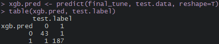

## Классификация игроков НБА по трём группам (гарды, форварды, центровые) с помощью моделей машинного обучения. Сравнение точности моделей и баскетбольных экспертов (в работе).

### Задачи эксперимента:

1. Сравнить точность моделей машинного обучения и экспертов (для 2 и 3 позиций).
2. Сравнить величину падения точности у моделей и экспертов при усложнении задачи классификации (добавлении группы форвард).

#### Описание

На сайте [stats.nba.com](https://stats.nba.com) в разделе **Players** один из дополнительных фильтров, Position, делит игроков на три группы:

* Guard (сокращенно G)
* Forward (F)
* Center (C)

Я решил сделать два типа классификаций:

* Классификация 2 групп (G и C)
* Классификация 3 групп (G и С)

Для этого я решил построить несколько моделей машинного обучения:

* Random Forest
* XGBoost
* CatsBoost
* Bagged AdaBoost
* Neural network

Результаты моделей будут сравниваться с результатми опрошенных мною баскетбольных экспертов. Каждому из них будет предоставлено 2 набора данных по 100 баскетболистов в каждом и иони должны будут также классифицировать их в одном наборе по двум группам, в другом по трём.

#### Модели машинного обучения

##### Корреляционная матрица предикторов


##### Модель Random Forest для классификации баскетболистов по трём группам

[Модель случайного леса](https://ru.wikipedia.org/wiki/Random_forest) отличается от обычного дерева решений тем, что в этом методе используется множество разных деревьев и для построения каждого из них используются ограниченное число предикторов, которые выбираются случайным образом.

Результаты модели, созданной с помощью пакета ```caret```:


##### Модель XGBoost для классификации баскетболистов по двум группам

[XGboost: Extreme Gradient Boosting](https://cran.r-project.org/web/packages/xgboost/index.html) в этой модели используется [метод градиентного спуска](http://www.machinelearning.ru/wiki/index.php?title=Метод_градиентного_спуска). Этот алгоритм является одним из самых быстрых и точных алгоритмов градиентного спуска, его используют многие победители соревнований Kaggle.

Результаты модели созданной с помощью пакета ```caret```:



График важности предикторов:


Результаты модели созданной с помощью пакета ```xgboost``` без настройки параметров:


Матрица ошибок:


##### Модель XGBoost для классификации баскетболистов по группам группам

Результаты модели созданной с помощью пакета ```xgboost``` без настройки параметров:


# Статья будет дополняться новыми данными по мере их получения
